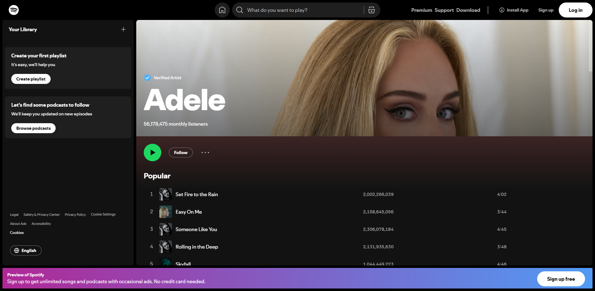

# 🎵 Spotify Artist Scraper & API Testing Suite

This project involves testing Spotify's platform using two tools:

- 🧪 **Selenium WebDriver** for UI-based automation testing  
- 🧪 **Postman** for REST API testing via Spotify Web API

---

## 📌 Tools Used

| Tool     | Purpose                     |
|----------|-----------------------------|
| Selenium | Automates web interface     |
| Postman  | Sends requests to Spotify API |

---
## 🧭 Selenium UI Test
The Selenium script automates the following steps on the Spotify web interface:

1. Opens the [Spotify Search](https://open.spotify.com/search) page  
2. Accepts cookie consent if prompted  
3. Searches for an artist (e.g., *Michael Jackson*)  
4. Clicks on the artist’s public profile  
5. Scrolls through the artist's page  
6. Extracts the top 5 track titles  
7. Saves a screenshot of the artist's page  

---

## 📸 Example Output

```
Opened Spotify search page.
Accepted cookies.
Searched for Michael Jackson.
Clicked on Michael Jackson's artist page.
Scrolled to bottom of artist page.
Top tracks:
1. Billie Jean
2. Beat It
3. Thriller
4. Smooth Criminal
5. Black or White
Screenshot saved: saved_artist_pages/michael_jackson_artist_page.png
```


---


> 🔒 No Spotify login required. All actions are performed on publicly accessible content.

---

## 🛠️ Requirements

- Python 3.7+
- Google Chrome browser
- [ChromeDriver](https://sites.google.com/chromium.org/driver/) matching your Chrome version

Install dependencies:

```bash
pip install selenium
```

---

## ▶️ Running the Script

1. Clone the repository or copy the script
2. Make sure `saved_artist_pages/` folder exists (or it will fail to save screenshot)
3. Run the script:

```bash
python selenium_tests.py
```

A Chrome window will open, navigate to Spotify, search for the artist, scroll the page, extract track names, and save a screenshot.

---

## ✅ Features

- Real browser interaction with Chrome via Selenium
- Handles cookie consent popup
- Works without needing Spotify login
- Easily customizable to search for other artists

---

## 📸 Example Image


---

## Postman

This project includes extensive API testing of the Spotify Web API using Postman, covering a variety of endpoints and HTTP methods (GET, POST, PUT, DELETE). Both positive and negative test scenarios have been implemented to ensure API reliability, security, and correctness.

## 📂 Collection Structure

A collection named "Spotify Web API Test Suite" was created, organized into multiple folders based on functionality, including: Browse, Playlists, User Details, Tracks, Search, and Albums.

```
Spotify Web API Test Suite/
├── Browse/
├── Playlists/
├── User Details/
├── Tracks/
├── Search/
└── Albums/
   
```

## 🔗 Tested Scenarios
- ✅ Valid and invalid authentication (token presence and expiration)
- 🔍 Data retrieval via GET endpoints
- 📝 Data creation with POST requests
- ✏️ Data update using PUT requests
- ❌ Data deletion via DELETE (where applicable or simulated)
- ⚠️ Error handling for unauthorized, forbidden, or malformed requests
- 📊 Schema and field validation for returned objects
- ⏱️ Performance benchmarks for response times

## ✅ Key Assertions Implemented
- Response status codes (e.g. 200, 201, 204, 400, 401, 403, 404) are as expected for each case

- Response time thresholds are respected (e.g. < 200ms for standard requests)

- Positive tests:

  - Correct structure and field presence in successful responses

  - Matching response data (e.g., album names, artist IDs, etc.)

  - Proper authentication flow using Bearer Tokens

- Negative tests:

  - Missing or invalid tokens result in 401 Unauthorized

  - Invalid parameters return expected errors (e.g. 400 Bad Request)

  - Accessing protected endpoints without proper scopes yields 403 Forbidden

## 🚀 How to Use the Postman Collection

To run the API tests included in the **"Spotify Web API Test Suite"** collection, follow the steps below:

### 📥 1. Import the Collection into Postman

- Open [Postman](https://www.postman.com/)
- Click on **"Import"** in the top-left corner
- Select the file: [Spotify Web API Test Suite.postman_collection.json](/Postman%20API%20Collection/Spotify%20Web%20API%20Test%20Suite.postman_collection.json)


---

### 🌍 2. Set Up Environment Variables

To access the Spotify Web API, you must provide a valid **Bearer Token**.

We recommend creating a new Postman **Environment** and adding the following variable:

| Variable Name   | Example Value              | Required |
|-----------------|----------------------------|----------|
| `access_token`  | `BQD1...your_token_here`   | ✅ Yes   |

#### 🔐 How to Get a Token

- Go to: [Spotify Web Console](https://developer.spotify.com/console/)
- Choose any endpoint (e.g., `/browse/new-releases`)
- Click **"Get Token"**
- Log in with your Spotify account and authorize access
- Copy the token and paste it into your Postman environment under `access_token`

> ⚠️ Note: Tokens expire after 1 hour. You will need to generate a new one when expired.

---

### ▶️ 3. Run the Collection

You can either:

- Run individual requests manually  
**OR**  
- Use Postman’s **Collection Runner**:

1. Click the **"Runner"** icon in the top-left
2. Select the **"Spotify Web API Test Suite"** collection
3. Choose the environment that includes your `access_token`
4. Click **Start Run**

---

### 🧪 4. View the Results

Postman will show:

- ✅ Passed and ❌ Failed tests
- ⏱️ Response times
- 📦 Full response bodies and headers

Each request has built-in test assertions available in the **"Tests"** tab.


## 📂Project Folder Structure 

```
QA_Project
├── Postman API Collection/
│   └── Spotify Web API Test Suite.postman_collection.json
└── Selenium_Test/
    ├── selenium_tests.py
    └── saved_artist_pages/
        ├── adele_artist_page.png
        └── michael_jackson_artist_page.png
├── .gitignore
├── Report.pdf
├── LICENSE
└── README.md
```
## 📄 License
This project is licensed under the MIT License.